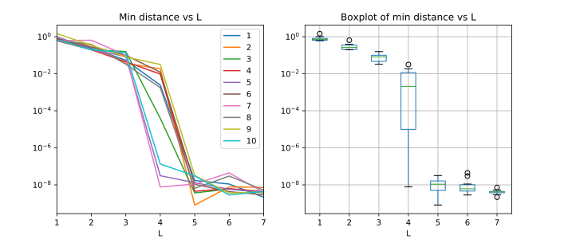
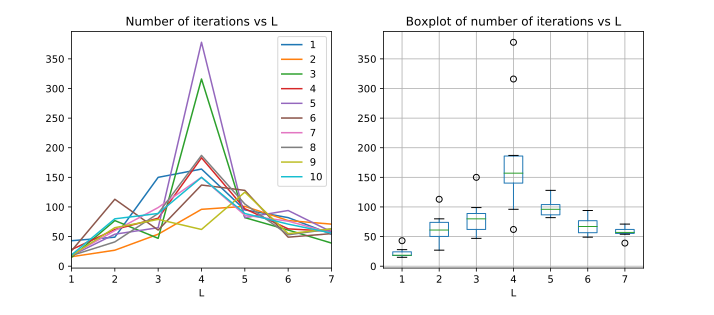
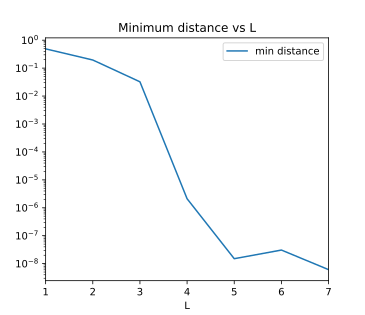

## Task 1

### Description

In this task, we had to implement the following circuit:

         ┌───────────┐ ┌───────────┐         ┌─────────────────────┐ ┌─────────────────┐
    q_0: ┤0          ├─┤0          ├─       ─┤0                    ├─┤0                ├
         │           │ │           │         │                     │ │                 │
    q_1: ┤1          ├─┤1          ├─       ─┤1                    ├─┤1                ├
         │  U_1(θ_1) │ │  U_2(θ_2) │   ...   │  U_{2l-1}(θ_{2l-1}) │ │  U_{2l}(θ_{2l}) │
    q_2: ┤2          ├─┤2          ├─       ─┤2                    ├─┤2                ├
         │           │ │           │         │                     │ │                 │
    q_3: ┤3          ├─┤3          ├─       ─┤3                    ├─┤3                ├
         └───────────┘ └───────────┘         └─────────────────────┘ └─────────────────┘

where the i-th odd block is 

         ┌─────────────┐
    q_0: ┤ Gate(θ_i,1) ├
         ├─────────────┤
    q_1: ┤ Gate(θ_i,2) ├
         ├─────────────┤
    q_2: ┤ Gate(θ_i,3) ├
         ├─────────────┤
    q_3: ┤ Gate(θ_i,4) ├
         └─────────────┘

and the i-th even block is

         ┌─────────────┐
    q_0: ┤ Gate(θ_i,1) ├─■──■──■──────────
         ├─────────────┤ │  │  │          
    q_1: ┤ Gate(θ_i,2) ├─■──┼──┼──■──■────
         ├─────────────┤    │  │  │  │    
    q_2: ┤ Gate(θ_i,3) ├────■──┼──■──┼──■─
         ├─────────────┤       │     │  │ 
    q_3: ┤ Gate(θ_i,4) ├───────■─────■──■─
         └─────────────┘

In principle, odd block gates are RXs and even block gates are RZs, but we can consider other parameterized gates too.

Each of the parameters θ_i is a vector of parameters, one for each gate in the i-th block. The goal of the task is to variationally find the parameters that minimize the norm between the resulting state and a random state and observe how it changes with the number of layers L.

### Implementation

The circuit and the execution are made using Qiskit. Obviously, we need to access the resulting state vector, so we do need to simulate the whole state using the `statevector_simulator` backend. For the optimization, I used `scipy.optimize.minimize` which used the L-BFGS-B solver.

The set of parameters are to be initialized between 0 and 2π. Actually, the angles should be between 0 and 4π, since that's the parameter range for single qubit rotations (RX, RY and RZ angles are divided by 2). However, notice that all matrix elements different than 0 in those matrices are trigonometric functions (sin(θ/2) or cos(θ/2) for RX and RY and exp(±iθ/2) for RZ), which have the property that f(θ/2 + π) = -f(θ/2). Therefore, all three matrices have period 2π up to a global phase. One might think that a global phase is irrelevant, and of course that's true in theory, but there is a peculiarity that we have to consider. The cost function is defined as the squared norm of the difference between the vector we are generating and a random vector. Here, the global phase is not irrelevant. For a fixed random vector, two physically equivalent vectors like |v> and e^{i \phi}|v> would produce very different metrics. Therefore, we have to make sure that our circuit will be able to arbitrarily approximate any vector in the Hilbert space, provided it has enough layers. Otherwise, had we the bad luck to pick a random vector that is unreachable by our circuit, we could end up with a less than optimal solution.

To convince ourselves that this is the case, consider a circuit with L layers. If one of the subblocks consists of RZs, we could use the other 2L-1 subblocks to build a state as close as possible to our goal state, up to a global phase, and then use the RZs to tune the phase. If there are no RZs, they can be approximated up to a phase with RXs and RYs. Therefore, the global phase is still irrelevant in the sense that it can be approximated with our circuit even though we are restricting the angles range.

As an alternative, we could try to get rid of the phases by 'normalizing' the global phase of both the random and computed vectors. For example, we could make the first component always real and positive by multiplying by the appropriate phase. I haven't done so, but it would be interesting to see and understand if that procedure compromises convergence in any way.

It is also worth mentioning that I had to disable all compiler optimizations. I suspect the reason is that Qiskit's transpiler is stochastic, and it may end up adding random global phases to the resulting vector in different iterations, which compromised the convergence. For the previous reason, if the global phase was the same for all circuit executions in a given optimization, the algorithm would have converged. In this case, though, the stochastic nature of the compiler generated different phases in each run, so the algorithm could not compute the actual gradient.

#### The algorithm

The sketch of the algorithm is very simple:

1. Generate the random vector to be used in a set of L passes.
2. For each number of layers:
3. Initialize the random set of parameters between 0 and 2π.
4. Build the L-layer circuit with the specified gates.
5. Optimize the parameters using gradient descent until convergence.

#### Using the program

The code is given as a CLI program. After installing the requirements using `pip install -r requirements.txt` run it with

```bash
main.py --help

usage: main.py [-h] [-m MINL] [-i ITERATIONS] [-o {rx,ry,rz,u1,u2,u3,phase}]
               [-e {rx,ry,rz,u1,u2,u3,phase}] [-s SEED] [-l LOGFILE] [-v]
               maxL outfile

QOSF mentorship program task 1

positional arguments:
  maxL                  The maximum number of layers to simulate
  outfile               A filename to write the results to. Results are stored
                        as a (number of layers, minimum of metric) CSV file

optional arguments:
  -h, --help            show this help message and exit
  -m MINL, --minL MINL  The number of layers to start with (default: 1)
  -i ITERATIONS, --iterations ITERATIONS
                        The number of iterations to simulate (i.e. the number
                        of random statevectors, default: 1)
  -o {rx,ry,rz,u1,u2,u3,phase}, --odd {rx,ry,rz,u1,u2,u3,phase}
                        The parameterized gate to use in the odd layers. One
                        of rx, ry, rz, u1, u2, u3, phase (default: rx)
  -e {rx,ry,rz,u1,u2,u3,phase}, --even {rx,ry,rz,u1,u2,u3,phase}
                        The parameterized gate to use in the even layers. One
                        of rx, ry, rz, u1, u2, u3, phase (default: rz)
  -s SEED, --seed SEED  Set the random number generators seed
  -l LOGFILE, --logfile LOGFILE
                        A filename to store debugging messages to
  -v, --verbose         Print debugging messages to stdout
```

### Results

The [results](results) folder contains the CSV files produced by the program.

#### RX and RZ gates

The execution with the default gates can be reproduced with the following command

```bash
/main.py 7 results.csv -i 10 -s 1234
```

The following figure shows the results of optimizing the cost function with 10 different random vectors between 1 and 7 layers.



The plot clearly shows that between 1 and 3 layers there is an exponential decrease in the minimum distance, then at 5 layers the final result is close to optimal and each new layer decreases the minimum distance by a small amount. L = 4 marks the boundary between both behaviours, with its distance closer to the 1-3 or 5-7 sets depending on the vector.

There is another interesting way to look at this, which we can use to understand better the convergence. The next figure shows the number of iterations until convergence as a function of the number of layers.



It can be seen how at L=4 there is a spike in the number of iterations we need to reach convergence. After L=4, adding more layers results in less fine tuning of the parameters and relatively few gains in the minimum distance. 

I think there are two reasons for this behaviour. First, the more layers there are, the more parameters. This could explain the initial exponential decrease in the metric. The behaviour for L >= 5 could be, at least in part, explained by the tolerances we are using in the optimization. We would probably not see any further significant increase in the metric with a greater number of layers, and the number of iterations would decrease for a fixed tolerance because, as I already mentioned, it would be easier to reach the required convergence with more parameters.

#### Other gates

The program has two parameters to optimize the circuit with gates different than the default. The options are RX, RY, RZ, U1, PHASE, U2 and U3 gates. Of these, one should expect a similar behaviour if any of the default gates (RX and RZ) were replaced by RY, U1 and PHASE gates. The latter two are the most obvious ones, since they are the same and differ from RZ by a phase. The RY gate is similar to the other two in the sense that it rotates a qubit by a single axis, so I don't expect it to make a difference.

The U2 and U3, though, are good candidates to improve the convergence towards the random vector. They have 2 and 3 parameters, respectively, and they act by rotating a qubit by two or three axes. However, when I ran the program with U3 gates in both odd and even blocks, the results were very similar to the previous ones.



I think the reason is that no matter which gates we choose, the actual limits are imposed by the number of gates. In order to arbitrarily approximate a four-qubit state, we need 9 CNOTs and 17 single-qubit rotations [1]. This means that we would need, at least, 9 CZs and 17 parameterized gates in our circuit, neglecting other facts and making a one-to-one correspondence. That's only possible after L=3. Moreover, our circuit doesn't have the gates in the specific order mentioned in [1], so it makes sense that we would be a small overhead. Also, regarding the number of single-qubit gates, using two U3 is not different to using a single U3, since a single U3 is already the most general single-qubit rotation. On the other hand, an RZ and an RX together are not a general rotation, but after several layers they are probably enough to approximate any rotation. All together, this results signal that the circuit structure is more important than the specific gates we choose, for the variety of reasons explained.

### Conclusions

We have implemented the circuit and optimized the cost function. Its behaviour with respect to the number of layers shows that there is an initial fast improvement in the distance between the random goal vector and the circuit output, which lasts until L=4. Then, for L>=5, the metric improves only marginally.

We have hypothesized that this is due to two factors. The first one is the increase in the number of parameters with each layer, which make the circuit easier to arbitrarily approximate any given unitary. The other factor are the convergence criteria of the algorithm, which probably make the optimization stop at greater L at good but maybe not optimum values. This last factor is supported by the number of iterations needed until convergence.

We have also seen that using more general rotations does not reduce the cost function significantly, and we have used known results to hypothesize that the circuit structure is more important than the gates we choose.

To keep working on the task, it would be interesting to understand whether these factors are the key drivers of the convergence and what's their influence with more detail. We could, for example, fine tune the hyperparameters to see whether the cost function and gradient tolerances are stopping convergence before reaching a global minimum. We could also try another optimization algorithms and try to replicate the results. The behaviour around L=4 seems interesting. One could, very handwavely, look at it as a critical point in a phase transition. However, before understanding it in terms of the parameters we should verify that it is not an artifact of the algorithm. Finally, to better understand the importance of the circuit structure, we could try to change it in some way and see if that does make a difference.
